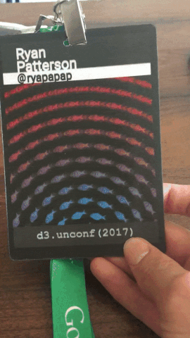

D3 unconf is a tech conference about data visualization. I was really struck by how kind everyone was.

I wanted to make a post here because one of the cool things about it is that they let you make your own badge! Here's a link to what I made a badge out of:

[Fishes](https://bl.ocks.org/ryapapap/77efc0ea1f028068a8bbf2776fdc4838)

and here's what the end result was like:

There's not much else to say about it; every thing else left over is just conversations in my head. I'd like to go again and make a larger effort to make something at the workshops...
