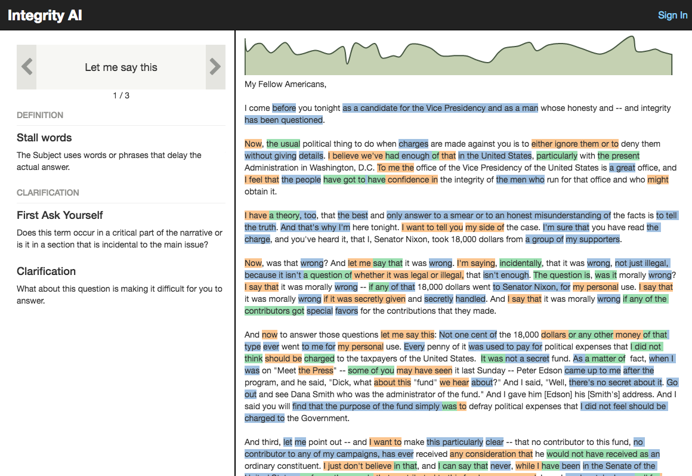

Integrity AI was the first project I worked on at Bonsai. 

The first task was to build a CRUD app which would allow for maintaining a database of 300,000 search terms. Starting with this task let me get comfortable with the tools we were using. We chose to build the web interface with React. It was my first time building an interface in React and it was the peak of Javascript fatigue where there were a lot of articles complaining about everything you needed to know in order to build a website. I think things have gotten better now, but I'm glad that I was able to learn some of these tools and why they exist before they've become abstracted away with different packages. We also had a Python flask app and we ran everything in some containerization (which we’d deploy to AWS). Many of these tools were new to me, but I feel I was able to get up to speed on them pretty quickly.

After getting the management of the terms set up, we wanted to make a way to search a given document for these terms. We made a textarea where you can input text and submit it the flask app which will find all the matches. Displaying them in the browser was a little complex, but Facebook had released Draft.js about this time and it was possible to use the extensions to it to allow for some interactivity. Here's what the final product looked like:

The color of the highlights is based on the root category a term comes from (the categories are organized in a tree structure). The graph is visualizing the amount of a paragraph that is highlighted. You can click on it to take you to the paragraph it's referencing. Clicking a term will show you what category the term belongs to and some information about it.

I'm pretty happy with the performance. It scales well. Putting in _Moby Dick_ takes about the same time to process as a news article. There's a lot of low-hanging fruit which would make a big difference for performance as well. The client-side rendering of the words is definitely the bottleneck with large text bodies and serverside rendering would likely help. In addition, the matching would be perfect for parallelizing as it goes through the words sequentially.

My work shifted away from this after we got it into this minimally-viable state.