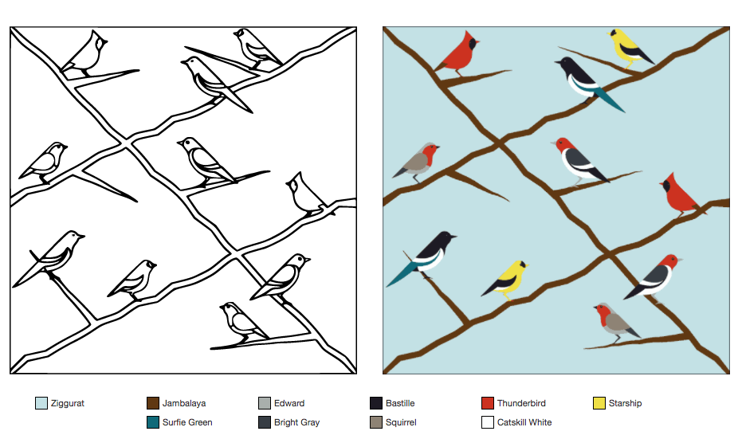
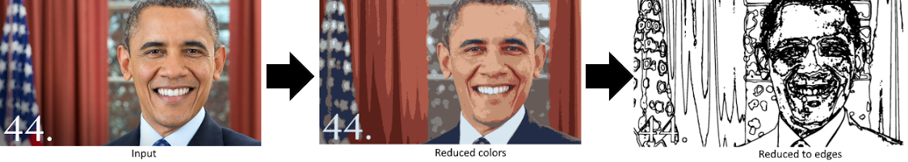
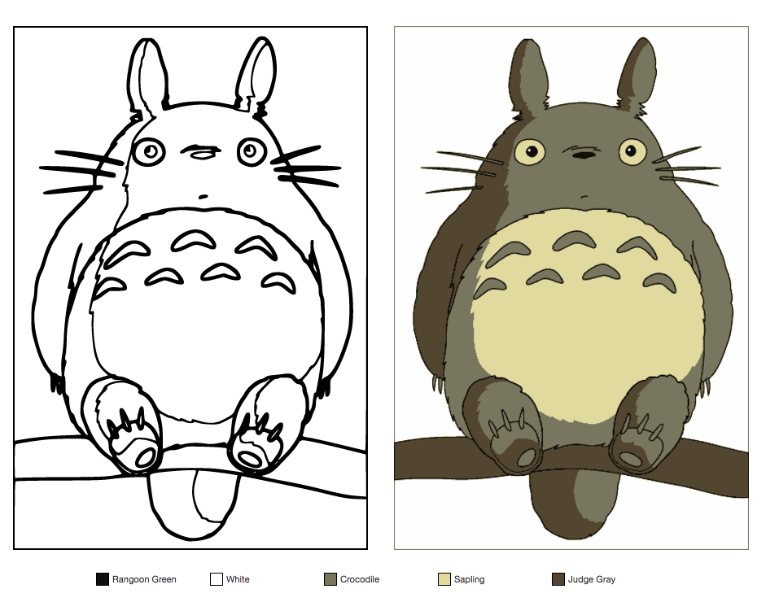
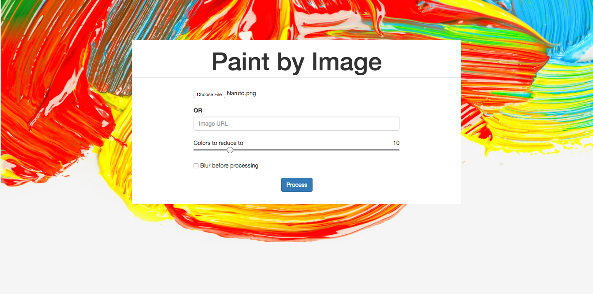
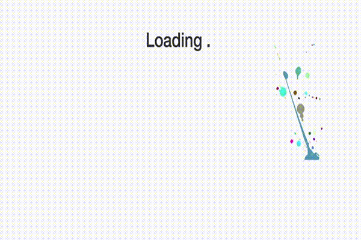
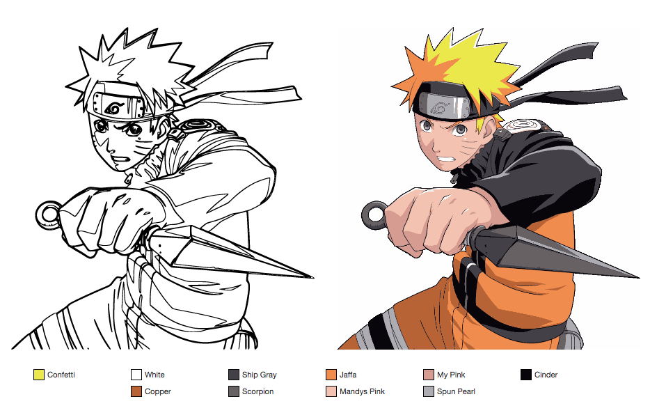
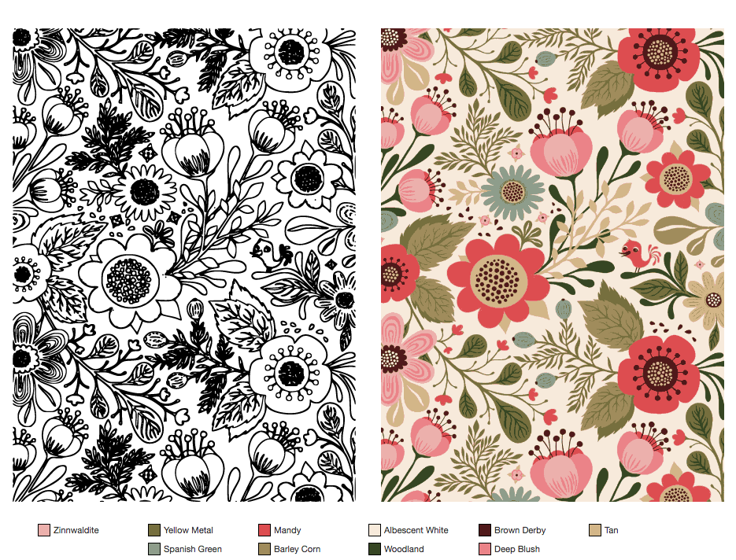

A while ago, I was painting one of those paint-by-numbers kits. While I was doing it, I started to think about what it would take to make a paint-by-numbers kit with some image processing. This is the result of experimenting with that idea.

One of the first challenges was figuring out which ‘important’ colors were in the image. A lot of images have some gradients that I’d like to merge into one color.

I first thought about simple solutions like taking the distance between colors (where the red, green, and blue values are axis), but this is a poor solution because it doesn’t account for the fact that each axis is independent. 

When I recognized this, I had to go back to the drawing board. With more thought I decided to use a k-means clustering algorithm to find the similar colors. This was a lot better for finding good colors.

The other steps in the processing were a lot more straightforward. I used the clusters I had made to do a pass on the image and change every color to one of the reduced colors. Once I had this, I could detect images by seeing if a pixel had a different color than its border. After that, I found a tool called potrace which could convert my image of the edges into an SVG (that way it scales to whatever size we want and we can print it). If my words aren’t clear, here’s a simple chart:

(I used this example because you can see a situation it performs poorly (real life images))

That’s it!

Once I had that, I wanted to make a simple web interface to use it. Because I had done the image processing in python, I made a simple web app with flask. Here’s the form I ended up making for getting images converted:

The algorithm does take a few seconds to load, which I thought meant it was a good opportunity to explore an ‘interesting’ loading screen:

I guess it’s clear I’m not a designer.

Once I had the output, I wanted to try and display it in a useful way. I found a library that would convert RGB colors to named colors and used it to make a list of the colors we reduced to. I also made a print feature that would scale the image to full-screen.

I had this project hosted on AWS at some point, but I wasn’t really improving it and they were charging money, so I took it down. I do know a lot more about web dev now and have some ideas for improving on what I did.

In general, there’s still a lot of improvements I feel like this project could use. There’s some online SVG editors that I could integrate into the site to delete stray lines or maybe add some. That’d help when it doesn’t do a particularly good job getting the borders. I also thought about what it’d be like to make a company based on something like this. I think it’d be coolest if you could sell people their own kits, where they’d feed an image and clean it up and then order a kit which would print it off on some type of decent material, get the right shades of paint and ship it to them. There’s a lot of logistics involved in that, but I think it’d be a fun thing to do.

I don’t think I’ll ever return to this project. I’ve started exploring other things and getting this far was enough to satiate my curiosity.
