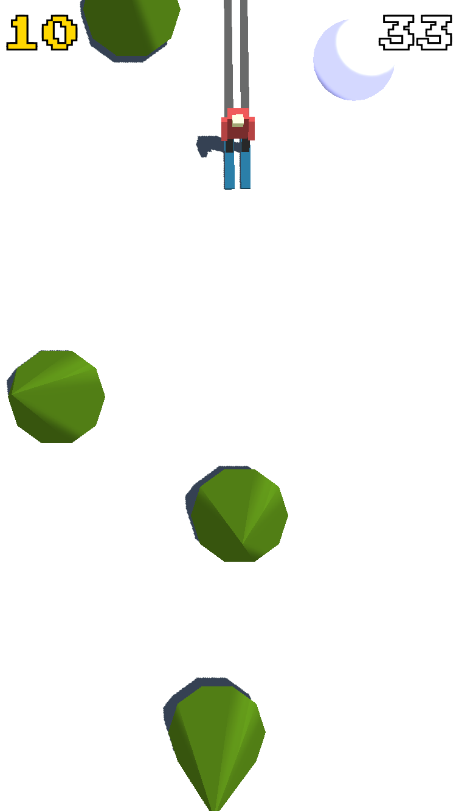
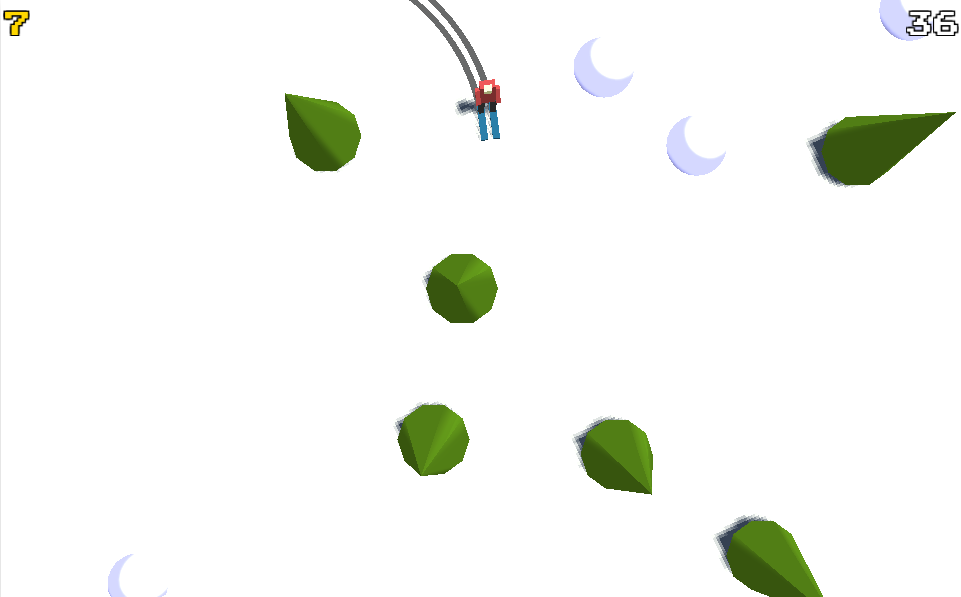
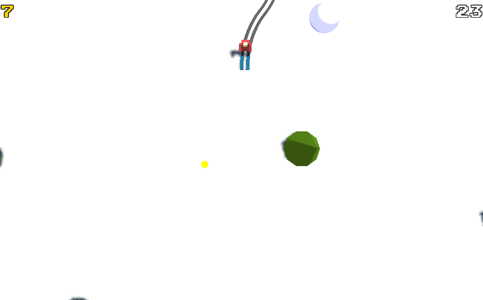

I came up with this idea after playing _Crossy Road_. I really like how it modernized an old game, _Frogger_. I was thinking of other games that I had played as a kid that could be given a similar treatment. I eventually thought of _SkiFree_, the game where you ski down and eventually run into a yeti that eats you and I thought it could work. Its rules, controls, and artwork are all relatively simple.

This project is my attempt at a _Crossy Road_ inspired _SkiFree_ game. I used Unity (writing in C#) to create it. It was my first time using Unity and I was happy with all of the conveniences it gave me.

Let’s walk through it.

I knew that I wanted to make the game work on mobile. I decided to make a control scheme where you touch the left side of the screen to go left and the right side of the screen to go right.

Once I had decided this, I needed to build a lot of basic game mechanics and assets. I built all of the art with primitives in Unity, so they’re all a bit simple. The white-blue weird circle thing is supposed to be a hill. If you hit it, the screen will shake for a moment.

Then I spent a bit of time trying to balance the game: figuring out good values for either increasing the acceleration of the player and the density of the obstacles in the map. I feel comfortable with where it’s at. It doesn’t feel too unfair, but it’s also pretty hard to get very high scores (at least for me).

A lot of my time spent in the code was trying to figure out the best way to organize the code in Unity. It felt like the system is pretty hands off about it, so I wasn’t sure which scripts should own which behavior. This mattered the most when I was writing the scripts to generate the terrain. The terrain needs to know about the player’s position in order to know what ‘chunk’ to show while also knowing about all the objects its placing (so they don’t overlap).

There’s still a lot of work to do. For one, the game lacks a lot of the personality that a game like _Crossy Road_ has. Some of this definitely comes from the artwork, which I don’t really have the ability or time to create, but it also comes with the end game screen. I think the crashes should be a lot more crazy. I don’t think I have the motivation (or skill really) to do this work well, so this is probably the final state of it. I’m pretty happy with it in that I think playing it is reasonably fun.

Although I made the game with the intention of playing it on mobile, Unity has options to build for different platforms. So, you can [check it out in your browser here](http://ski-game.s3-website-us-west-2.amazonaws.com/).