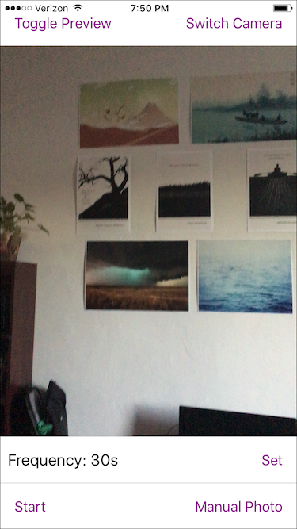

The Bay Area is a beautiful place and I'd like to try and share some of it with friends and family that haven't seen it before.. At the same time, I really don't like stopping to take photos. To try and solve this, I decided to make a few timelapse videos of things like walking to work, going for a bike ride, or a hike.

I made this app to help me do that. I built it over the course of a day using React Native. It was the first time I used React Native, but I was happy with how fast I was able to iterate. I'll likely use it again in the future. I wouldn't consider this app fully functional. It lacks a lot of nicities I'd expect. Here's what the UI looks like:

Toggle Preview turns off the display of the camera (I did this in case it'd save battery, I don't know if it actually does). Switch Camera switches between front and back camera. Frequency sets how often a photo is taken. You set it with a spinner after you touch the 'Set' button. I chose a spinner because typing numbers felt weird and I thought I could give enough options that I wouldn't want anything else (the range is from one second to an hour). Start will make a timer which will take a photo after the frequency has elapsed. Finally, Manual Photo will just take a one off photo. When a photo is taken, there's a quick animation which shows the text 'Taken' that fades away. You can see that in the thumbnail.

All of the photos are saved to the phone's library, after which I have to manually convert them into a video. And that's about it. It works for my purpose, even if it's a little contrived. I'm happy with what I learned about React Native and what it can do. I don't think I'll ever come back and add all the features and polish this would need to be considered good.

I plan to add some timelapse videos here, but Karl the Fog decided to start showing up as soon as I finished this app.