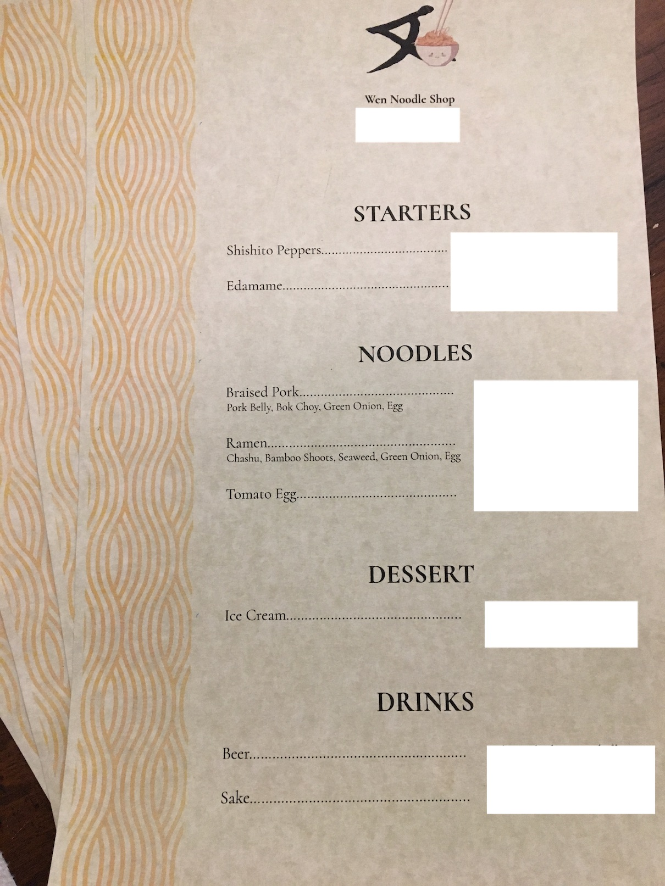
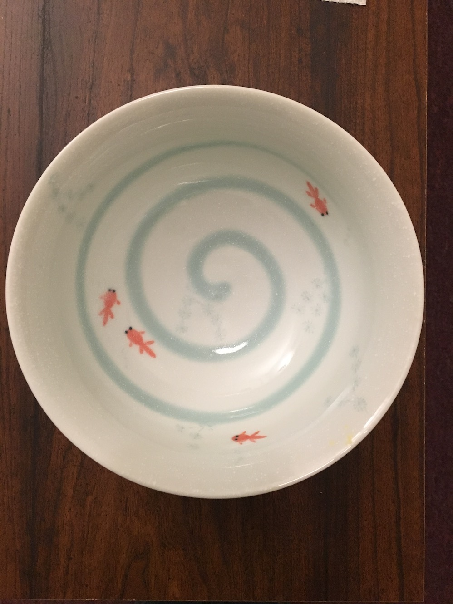
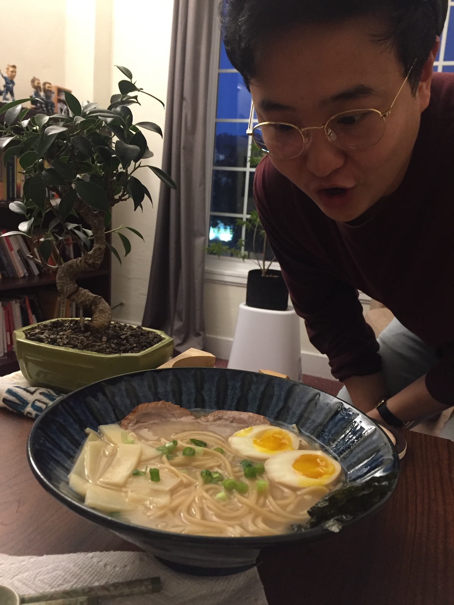
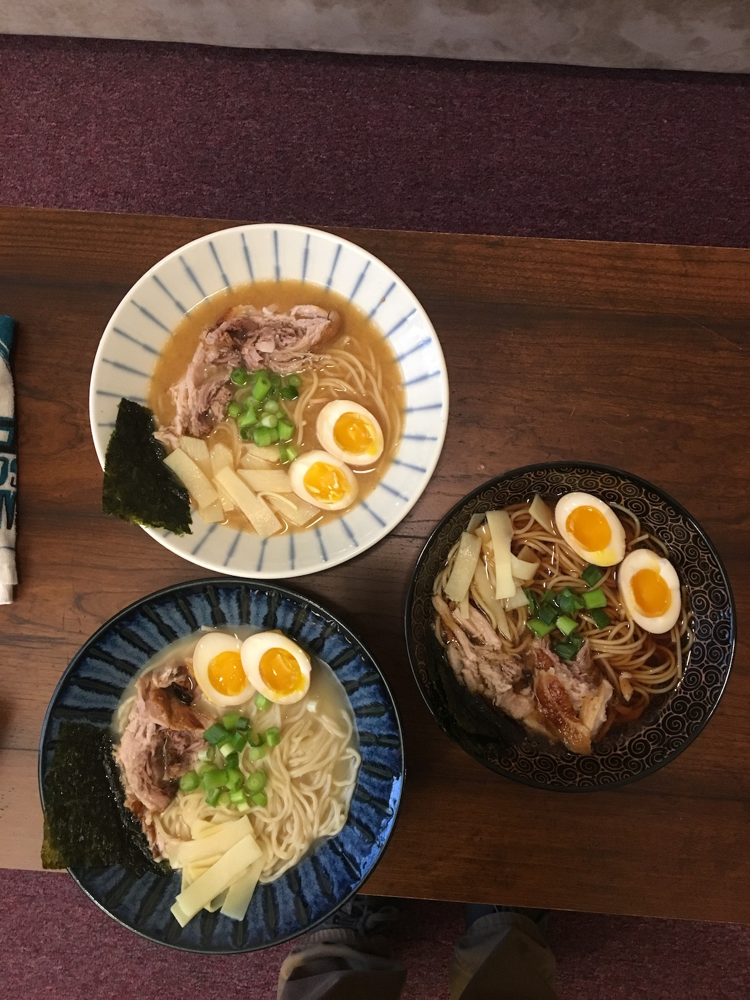

Wen Noodle Shop is my restaurant, or at least what I’m calling a series of dinner parties I’ve been throwing.

I call it a restaurant because I made a menu and let people order from it and that I have a non-monetary cost for each dish.. which is a question. The intention of the questions is to get people to reflect on who they are and how their past year has been. The questions are unique for each dish and aren’t revealed until people arrive so the answers can’t be pre-canned. An example of a question similar to the ones I chose is: what have you done really well? The hope is that the restaurant is a space where people can connect more deeply with some friends and feel safe talking about things that might not come up in everyday conversation (and, well, enjoy good food).

And it’s been great.

I came up with the idea after I had decided I wanted to learn how to hand pull noodles. If I ever succeeded, I decided I’d want to cook for people and if I was going to do that, I’d like to let them pick what they eat like a restaurant and then that the food should have cost, but I didn’t want it to be money. I decided on questions because it still feels like an exchange happens.. By the time I had came up with this idea, it was more exciting than hand pulling noodles which, it turns out, is pretty difficult.

The planning for the restaurant took a bit of work too. I had to find good recipes for all the dishes I wanted to make. I, then, had to source all the ingredients for the dishes. I visit at least four different grocery stores every time I’m opened and possibly a couple others for ingredients I don’t use as often. It also took a bit of time to get the right utensils, both for cooking and serving the food. I got some bowls that I really like.. at a futon store hahaha.

I don’t feel confident in my design skills, so it took me a bit of time to figure out to make a decent looking menu and then how to print it and decide on which questions to use. I also ended up making a website so people could make appointments and so I could explain some of how it works.

There were a lot of learnings I had over the first few times I was open. I wasn’t sure I’d be able to cook when people ordered and would have to make them order ahead, but it turns out it’s not too difficult once I understand the order of everything and how it goes. After the first couple times, I learned how to better pace the questions and took a suggestion to get a guest book which has worked well.

I did need a couple tries to get some of the recipes correct. For a while, I didn’t know what to do for broth in the braised pork dish and only recently found a recipe for menma that works well and decided on the right amount of time for boiling the eggs… There’s probably other things I can do to make the food better, but people seem to be pretty happy with.

All of the prep I mentioned ends up being a lot of work, but I’ve always felt like it’s been worth it after the conversations. I’ve learned a lot about the people who have came— some I’d never met before. Almost always I have a greater appreciation for someone after hearing their answers— sometimes it’s much deeper than I would’ve expected or reveals some side of them I didn’t know about or just captures something about them.

In the last couple times I’ve been open, I’ve gained an appreciation for how different the vibe can be depending on who’s there. Sometimes it may not be as jovial or free, but it always seems pleasant and I’ve always had something to give and receive. People seem to be open if you serve them good food.

I’ve cooked for over 50 people at this point and I think that I’ve got it down well enough to at least write this up.

A lot of the problems I’m interested in solving are human ones— things like how to connect deeply with other people. I think this project is a reflection of that desire and I’m happy with how it’s turned out and I’ve learned about making spaces for people.

I’d love if you could come. I haven’t set up any new appointments, but you can just email me 🙃

[Here’s the website I made.](https://www.wennoodleshop.com)
