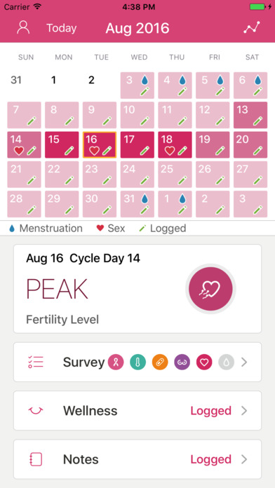
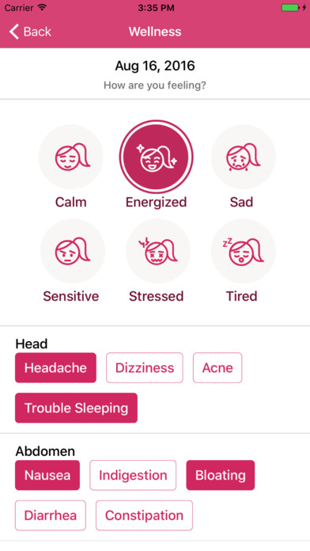
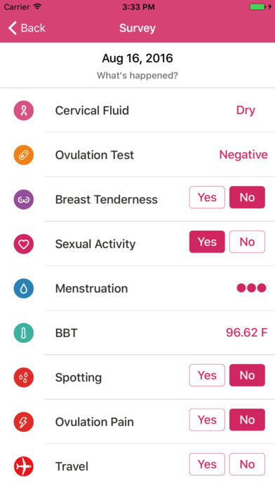
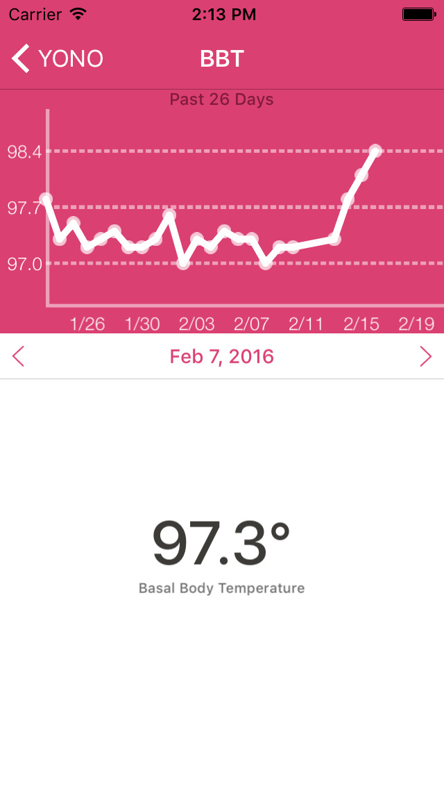

I joined YONO to learn more about early stage startups. I was the first engineer to join the team and was given a lot of freedom to choose the technologies we used.

The application itself was pretty well defined. We knew that we wanted a mobile application that would connect to the hardware device we had made (a small in-ear thermometer). In addition, we wanted to offer a lot of the functionality that other family planning apps offered. We decided I'd focus on making the iOS app first.

This was my first time building a mobile application so I had a lot to learn. The first bit, was just getting something to work. I found Interface Builder unintuitive and did not feel productive building interfaces with it. At the same time, version 2 of Swift was released and I thought the langugage was very nice. This led me to decide to build the UI programmatically with Swift.

We also needed some APIs for user accounts and predictions based on the thermometer's data. I chose Google App Engine for this because I found that Cloud Endpoints gave the right level of abstraction. I didn't have to worry about the hosting of a server or anything else, I could just focus on making the endpoints that would make the app work. I had previously made some small web apps with Python and chose it for implementing these endpoints.

After about a year of working on this project, I think my role had run its course. We had released the app in the App Store and most of the remaining work was with the hardware. It was clear the company was focusing on the hardware and I knew my interests lie in the software. We had grown to four engineers across the team (one other working on software and two working with the hardware).

I learned a lot during my time at YONO. Working on such a small team taught me a lot about working independently. We were working in an incubator and I got to see what a lot of different early stage startups look like. Being able to start the application from scratch gave me familiarty with a lot of the build steps that get hidden in larger companies. Being able to choose the technologies (and working with completely new ones) gave me better insight into evaluating and learning new technologies.

YONO has continued to make some updates to the app, so what you'll see in the app store is not only my work, but the app itself is still there. [Check it out](https://itunes.apple.com/us/app/yono-period-fertility-and-ovulation-monitor/id1039466025?mt=8).